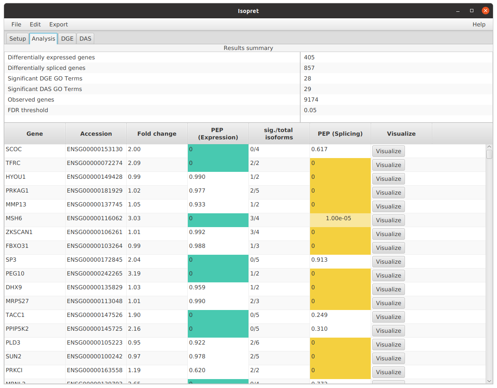
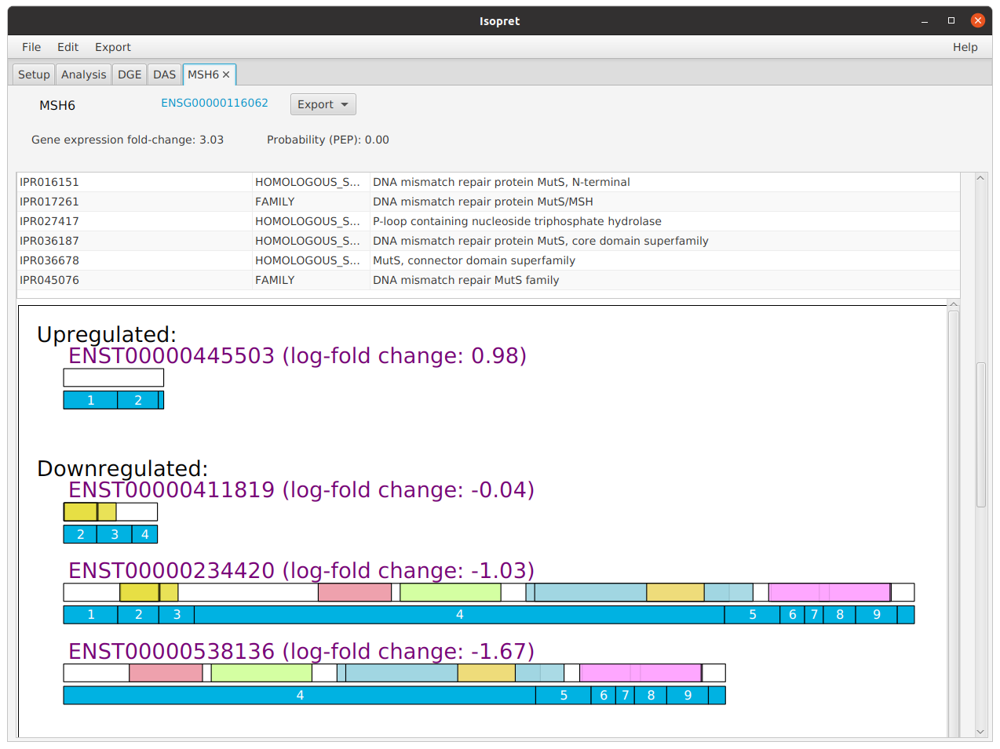
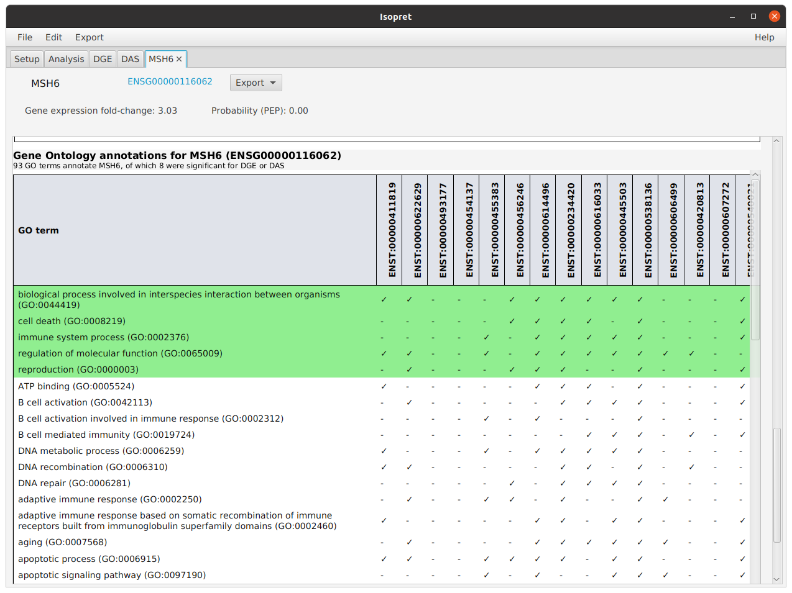
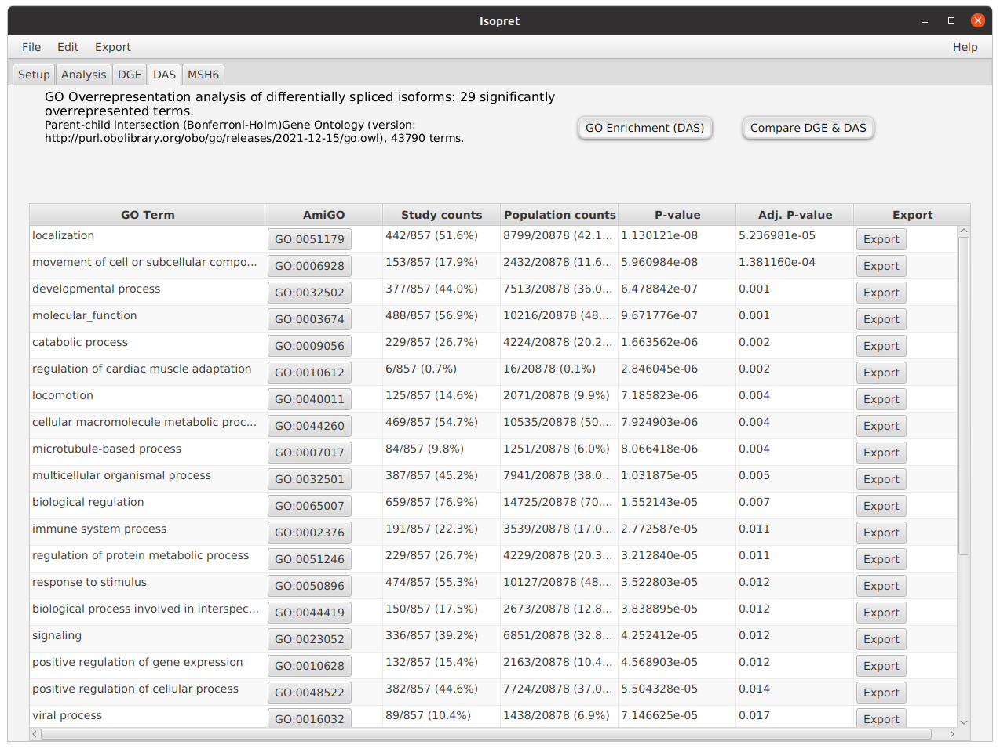
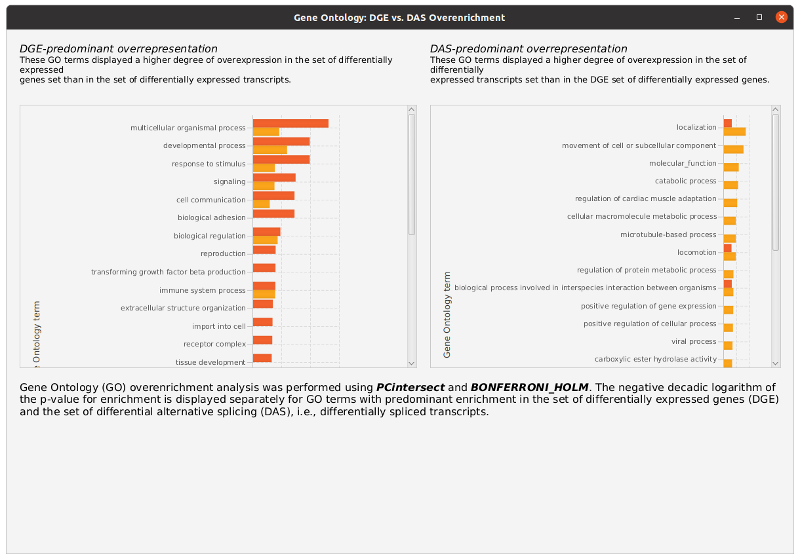

# Tutorial

This tutorial demonstrates how to generate the output shown in parts of the manuscript.

### Setup the graphical user interface (GUI) version of isopretGO

Follow the [instructions](running-gui.md) to download and start isopretGUI. Use the *Download* button (1) to download
the required input files.

Two HBA-DEALS files are provided for this tutorial in the `tutorial_files` directory of the GitHub repository:

- [Hooks_HBADEALS_output.txt](https://github.com/TheJacksonLaboratory/isopretGO/blob/main/tutorial_files/Hooks_HBADEALS_output.txt)
- [Wagner_HBADEALS_output.txt](https://github.com/TheJacksonLaboratory/isopretGO/blob/main/tutorial_files/)

Both files contain the results of HBA-DEALS analysis of hepatoblastoma datasets, i.e., with Bayesian analysis of differential gene expression and differential alternative splicing.

[Hooks KB, et al. (2018) New insights into diagnosis and therapeutic options for proliferative hepatoblastoma. Hepatology. 68:89-102](https://pubmed.ncbi.nlm.nih.gov/29152775/)
present RNA sequencing of 25 hepatoblastomas and matched normal liver samples.
[Wagner AE, et al. (2020) SP8 Promotes an Aggressive Phenotype in Hepatoblastoma via FGF8 Activation. Cancers (Basel) 12:2294](https://pubmed.ncbi.nlm.nih.gov/32824198/)
present RNA-sequencing of four primary hepatoblastomas with metastasis and seven primary hepatoblastomas without metastasis, 11 matching normal liver specimens and four liver tumor cell lines.

### Preparing isopretGO

The first time isopretGO is used, we need to download a number of input files. Click the ``Download`` button  to automatically download all files. Other ways of downloading the files are explained in the pages for running the  [GUI](running-gui.md) and [command-line](running-cmd.md) apps.

### RNA-Seq input file

isopret-GO takes as input a file with the result of analysis of differential expression and splicing in a cohort of samples analyzed by bulk RNA-seq. isopret-GO can process either [HBA-DEALS](https://pubmed.ncbi.nlm.nih.gov/32660516/) or [edgeR](https://pubmed.ncbi.nlm.nih.gov/19910308/) files. See the [input](input.md) for detailed explanations.

Select the  file  and press the Analyse! button.

<figure markdown>
{ width="800" }
<figcaption>IsopretGO setup  tab with buttons for (1) downloading the needed data files, (2) choosing the input RNA-seq results file, and (3) starting the isopret analysis.
</figcaption>
</figure>

Leave the Gene Ontology (GO) settings in their default values. If desired, other GO overrepresentation algorithms or multiple-testing correction (MTC) procedures can be used. See [Bauer et al. (2008)](https://pubmed.ncbi.nlm.nih.gov/18511468/){:target="\_blank"}. for information and
[Introduction to Bio-Ontologies](https://www.amazon.de/-/en/Charite-Universitatsmedizin-Berlin-Germany-Robinson/dp/1439836655){:target="\_blank"}. for detailed explanations.

### Analysis summary
After you press the *Analyse!* button, isopretGO will perform the analysis, which should take between 15-60 seconds on typical laptops. A progress bar is shown. isopretGO will then open the *Analysis* tab, which shows a table with all genes measured in the RNA-seq experiment, ordered by posterior error probability (PEP; See [Käll et al. 2008](https://pubmed.ncbi.nlm.nih.gov/18052118/){:target="\_blank"} for a primer on PEP).

<figure markdown>
{ width="800" }
<figcaption>IsopretGO Analysis tab.
</figcaption>
</figure>

To search for a specific gene, enter the gene symbol in the search bar on the left right underneath the table in this view.
For instance, enter the symbol MICU1, which refers to the [Mitochondrial Calcium Uptake 1](https://www.genenames.org/data/gene-symbol-report/#!/hgnc_id/HGNC:1530){:target="\_blank"} gene.

### Gene view
isopret-GO generates one page for each gene represented in the dataset (i.e., with at least one read and thus represented in the HBA-DEALS or edgeR output files).
Each page shows a table with information about the gene, the corresponding mRNA isoforms (transcripts), and their fold changes. Graphics are provided to illustrate the exon structure of the transcripts and the domain structure of the corresponding proteins; a table with the GO annotations for each isoform is shown at the bottom of the page. Users can export the visualizations as SVG or PDF and can export the annotations in tabular formats.

<figure markdown>
{ width="800" }
<figcaption>IsopretGO Gene View for MSH6.
</figcaption>
</figure>

### Protein view
isopret-GO shows the protein domains encoded by each expressed coding isoform.

<figure markdown>
{ width="800" }
<figcaption>IsopretGO Protein Domain View for MSH6.
</figcaption>
</figure>

### GO Annotations table
isopret-GO provides a table with the GO annotations inferred fort each isoform by the [isopret-EM](https://pubmed.ncbi.nlm.nih.gov/36929917/) algorithm.

<figure markdown>
{ width="800" }
<figcaption>IsopretGO GO annotations table for MSH6.
</figcaption>
</figure>

### GO Annotations table
isopret-GO provides a tab with GO overrepresentation analysis for differentially expressed genes and one for differentially spliced isoforms.

<figure markdown>
{ width="800" }
<figcaption>IsopretGO: GO overrepresentation analysis.
</figcaption>
</figure>

### GO Annotations: DGE vs. DAS comparison
isopret-GO provides a visualization of GO terms that were significantly overrepresented and compares the profiles of differential gene expression (DGE) and of differential alternative splicing (DAS).

<figure markdown>
{ width="800" }
<figcaption>IsopretGO:GO overrepresentation analysis - DGE vs DAS
</figcaption>
</figure>